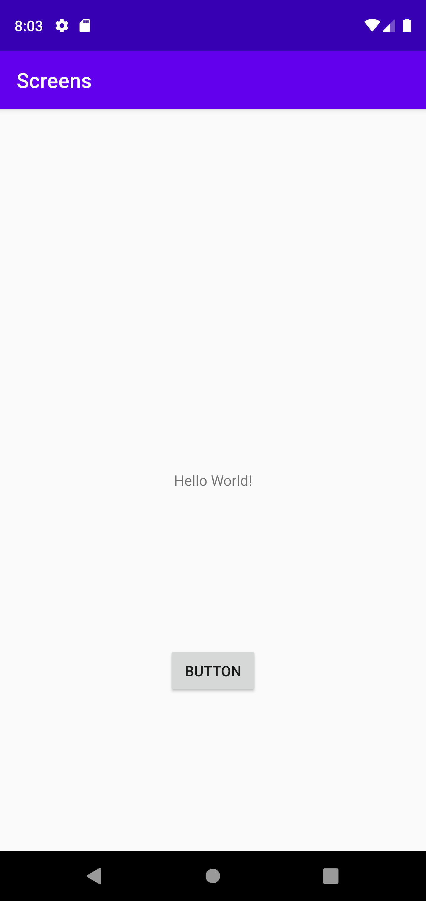
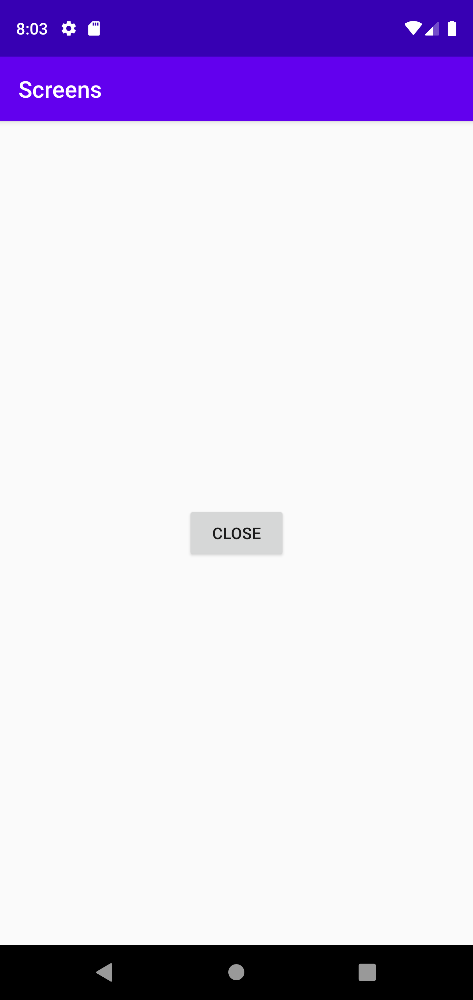

# Rapport

**Assignment 4 - Screens**

Uppgiften gick ut på att skapa en andra aktivitet och skapa en fragment.

Först krävs en intent som startar en ny aktivitet.
```java
    private Intent intent;
    @Override
    protected void onCreate(Bundle savedInstanceState) {
        super.onCreate(savedInstanceState);
        setContentView(R.layout.activity_main);
        intent = new Intent(MainActivity.this, SecondActivity.class);
        Button button = (Button) findViewById(R.id.mainButton);
        button.setOnClickListener(new View.OnClickListener() {
            @Override
            public void onClick(View v) {
                startActivity(intent);
            }
        });
    }
```
Den skapar en ny intent och skickar en till ett nytt fönster med en egen layout. Här finns skapas en fragment.
```xml
    <fragment
        android:id="@+id/fragment"
        android:name="com.example.screens.BlankFragment"
        android:layout_width="250dp"
        android:layout_height="250dp"
        android:tag="blank_fragment"
        app:layout_constraintBottom_toBottomOf="parent"
        app:layout_constraintEnd_toEndOf="parent"
        app:layout_constraintStart_toStartOf="parent"
        app:layout_constraintTop_toTopOf="parent" />
```      
Inuti fragment går det skapa flera olika widgets(vyer) här lades en knapp till som tar en tillbaka till ursprungliga aktiviten(startskärmen).
```xml
    <!-- TODO: Update blank fragment layout -->
    <Button
        android:id="@+id/backButton"
        android:layout_width="wrap_content"
        android:layout_height="wrap_content"
        android:text="Close"
        android:layout_gravity="center" />
```
Knappen positioneras i mitten av fragment genom layout_gravity.

Resultatet ser ut så här:



Denna bilden visar hur andra aktiviteten ser ut med en fragment och en knapp.



